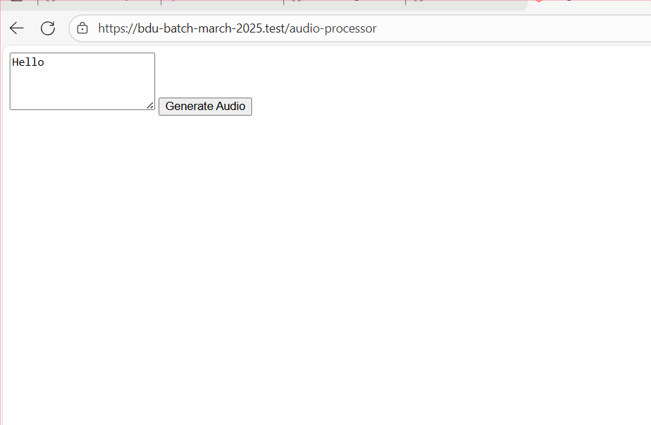

# Laravel OpenAI Audio Processor 🎙️🧠

This Laravel + Livewire component provides an AI-powered interface for:
- ✅ **Text-to-Speech** (using OpenAI's TTS model)
- ✅ **Speech-to-Text** (audio transcription using Whisper)

## 🚀 Features

- Convert text into realistic AI-generated speech (MP3)
- Upload an audio file and get its transcription in plain text
- Uses OpenAI's `tts-1` and `whisper-1` models
- Livewire-powered reactive UI
- Public URL for generated audio files

---

## 🛠️ Setup Instructions

### 1. Clone the repository

```bash
git clone https://github.com/your-username/bdu-batch-march-2025.git
cd bdu-batch-march-2025
